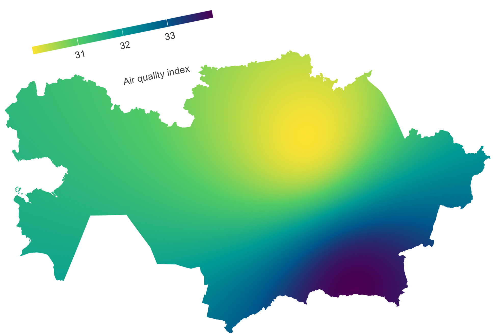

# air-quality-index-Kazakhstan

I have made a map of the air quality in Kazakhstan at the moment.

I developed this visualization using the R programming language using the libraries: tidyverse, http, gis com, sf, gstat, classintimdevky

This map shows the Air Quality Index (EQIQ) for Kazakhstan using a color gradient: from yellow, symbolizing cleaner air compared to other regions, to magenta, indicating a high level of pollution.

The data includes all air pollutants, including: PM2.5, PM10, NO2, SO2, CO.

The source of the data presented on the website waqi.info , is KazHydroMet, which collects information through its monitoring stations on the territory of Kazakhstan.
